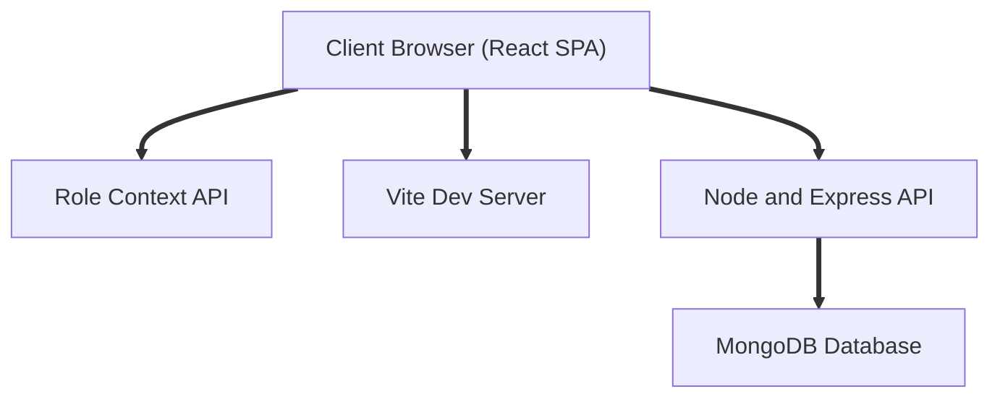

# TicketR Customer Support CRM

TicketR is a comprehensive full stack Customer Support Ticketing CRM System built on the MERN architecture. The application is designed to streamline support workflows, offering strict role based access control, an integrated conversational interface, and advanced data visualization metrics.

## System Architecture Diagram

## Architecture and Tech Stack Detailed

### Frontend Client
* React SPA bootstrapped with Vite for instant server starts and lightning fast HMR.
* Styled with Tailwind CSS v4 and Lucide React for crisp SVG iconography.
* Data visualizations powered by Recharts.
* Custom dark theme utilizing glassmorphism UI elements and subtle cubic bezier micro animations.
* LocalStorage integration for persisting user preferences.

### Backend Server
* Node.js and Express server routing RESTful API requests.
* MongoDB and Mongoose ODM for scalable document data storage.
* Security implemented via Helmet for HTTP headers, Express Rate Limit to prevent brute force attacks, and CORS configuration for safe cross origin resource sharing.
* Mongoose schemas designed with embedded documents for conversational notes and role tracking.

## Core Functionalities

### Role Based Access Control
The application handles two distinct user roles managed via React Context state management:
* Customer Role: Privacy focused view. Customers can create tickets and view only their own requests. The analytics dashboard is completely hidden, and all ticket metadata fields (Status, Priority, Category) are rendered as read only badges.
* Support Agent Role: Global visibility. Agents have access to all tickets and full control over triage (Status, Priority, and Category updates) but cannot create new tickets. They also have full access to the Analytics Dashboard and internal notes.

### Dashboard and Data Visualization
* Ticket Table: Sortable and filterable data table displaying ticket ID, Customer, Subject, Category, Priority, Status, and Creation Date.
* Custom Sorting Logic: Intelligent sorting algorithms map string priorities (Critical to Low) to numeric weights for accurate descending and ascending sorts.
* Analytics Overview: Pie charts visualize ticket distribution by category, while Bar charts track ticket severity.

### Conversational Interface
* Ticket Detail View: The internal notes system operates as a modern chat interface.
* Messages sent by the active user dynamically align to the right in blue bubbles, while incoming messages align to the left in dark grey bubbles.
* Auto Scroll: The chat automatically scrolls to the newest message seamlessly.
* File Attachments: Support for mock file attachments is included natively within the chat input area, complete with file selection UI and removal toggles.

## Application Workflow Guide

1. Ticket Creation Phase
A Customer logs into the portal and clicks the "New Ticket" button. They fill out their name, email, subject, and description. Upon submission, the Express backend auto generates a sequentially padded ID (e.g., TKT 004), defaults the priority to "Medium", and saves the document to MongoDB.

2. Triage and Assignment Phase
A Support Agent logs in and views the global Command Center dashboard. They select the newly created ticket. The Agent categorizes the issue (Technical, Billing, Account, or General) and adjusts the priority based on severity.

3. Resolution Chat Phase
Both roles communicate via the in built chat interface inside the ticket detail view. The backend API handles the addition of new notes, stamping each message with the exact sender role and timestamp. The UI strictly enforces who sent what.

4. Ticket Closure Phase
Once the issue is fully resolved, the Support Agent marks the ticket Status as "Closed" via the dropdown controls. The Customer can view this updated status in real time.

## Artificial Intelligence Integration

* Technology Used: Simulated AI Heuristics Engine.
* Implementation Details: Due to strict project deadlines and a focus on core stability over external API dependencies, the AI Summarization feature utilizes a mock intelligence engine built directly into the React frontend.
* How It Works: The algorithm processes the active ticket array in real time. It calculates percentages of "Critical" priority tickets versus total volume. If critical volume exceeds 20 percent, it dynamically generates a "System Health Alert" warning. Otherwise, it analyzes the most frequent category and suggests automated deflection strategies or outputs a "Status Stable" report.

## Setup and Installation Instructions

### Backend Setup
1. Navigate to the backend directory.
2. Install dependencies via npm install.
3. Create a .env file with your MONGO_URI and PORT configurations.
4. Run npm start to boot the backend server.

### Frontend Setup
1. Navigate to the frontend directory.
2. Install dependencies via npm install.
3. Run npm run dev to start the Vite development server.
